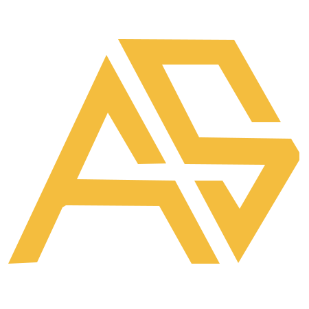

  

<h1 align="center">Hi, I'm Aref Shamspour 👋</h1>

<h3 align="center">Web Developer | WordPress | Front-End</h3>

  I build modern, responsive websites with a focus on clean design, performance, and practical solutions.
  My main focus is WordPress development, alongside front-end technologies and custom web solutions.

  
  

---

## 🛠 Tech Stack

### Web & WordPress

### Programming & Backend

### Tools & Workflow

---

## 🚀 About Me

* 🌐 I develop professional and responsive websites with a strong focus on WordPress.
* 🎨 I enjoy turning ideas and designs into clean, functional web experiences.
* 🧩 I work with Elementor and WordPress to build flexible and maintainable websites.
* 💻 I have a background in C# and ASP.NET Core and use that experience when a project requires custom development.
* ⚡ I care about performance, usability, maintainability, and attention to detail.

---

## 📫 Let's Connect

  
  
  
  

  Building for the web, with curiosity and attention to detail.

